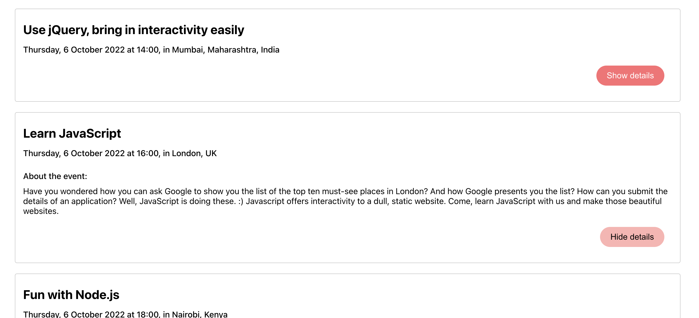

# meet

## Description
This is an progressive web application (PWA) that is built with React using a test-driven development (TDD) technique. The application uses the Google Calendar API to fetch upcoming events.

The app provides a list of upcoming events for any given city, with data provided by Google Calendar. The app works offline using cached data from the last time it was used online. The user can search for events in a specific city or browse all events, customize how many events are shown on screen, click an event for more details, and see how many events are upcoming in certain cities.

## Dependencies:
- HTML5
- CSS
- Javascript
- React
- React DOM
- React Scripts
- Axios
- NProgress
- Recharts
- Google Calendar API (incl OAuth2 authentication)

## Key Features & User Stories
### Filter events by city
As a user, I should be able to “filter events by city”, so that I can see the list of events that take place in that city.
##### Scenario 1: When user hasn’t searched for a city, show upcoming events from all cities.
```
Given user hasn’t searched for any city
When the user opens the app
Then the user should see a list of all upcoming events
```
##### Scenario 2: User should see a list of suggestions when they search for a city
```
Given the main page is open
When user starts typing in the city textbox
Then the user should see a list of cities (suggestions) that match what they’ve typed
```
##### Scenario 3: User can select a city from the suggested list.
```
Given the user was typing “Berlin” in the city textbox
And the list of suggested cities is showing
When the user selects a city (e.g., “Berlin, Germany”) from the list
Then their city should be changed to that city (i.e., “Berlin, Germany”)
And the user should receive a list of upcoming events in that city
```
---
### Show/Hide Details of an Event
As a user, I should be able to view and hide an event's details, so that I get more information about the event.
##### Scenario 1: An event element is collapsed by default
```
Given the user hasn’t opened the app
When the user opens the app
Then the event elements are collapsed
```
##### Scenario 2: User can expand an event to see its details
```
Given the list of event elements is loaded
When an event is selected by clicking the “details“ button
Then the event element will expand showing event details
```
##### Scenario 3: User can collapse an event to hide its details
```
Given the details of an event element are displayed
When clicking the “hide“ button
Then the event details are collapsed again
```
---
### Specify Number of Events
As a user, I should be able to specify the number of events, so that I can restrict or expand my number of event options. 
##### Scenario 1: When user hasn’t specified a number, 10 is the default number
```
Given user hasn’t entered any number of events 
When the user opens the app
Then the default number will be displayed
```
##### Scenario 2: User can change the number of events they want to see
```
Given the main page is open
When the user enters a number of events (e.g., “6”)
Then the user will see that specific number of events 
```
---
### Use the App when Offline
As a user, I should be able to open the app in offline modus, so that I can still see all events and their details from the last time I was online.
##### Scenario 1: Show cached data when there’s no internet connection
```
Given the app has no internet connection 
When the user opens the app
Then the cached data will be shown
```
##### Scenario 2: Show error when user changes the settings (city, time range)
```
Given the user is in the settings tab 
When the user submits any changes any settings data
Then an error will show
```
---
### Data Visualisation
As a user, I should be able to see the upcoming events in a chart, so that I have an overview of the amount of events per city.
##### Scenario 1: Show a chart with the number of upcoming events in each city
```
Given the user hasn’t opened the app
When the user opens the app
Then a chart will list the upcoming events taking place in all cities - unless the city is further defined
And a chart will list the percentage of event genres for all cities - unless the city is further defined
```

## Project screenshots
Login screen:


App screen:


App event list screen:


## Project Repository
[meet](https://github.com/netti-w/meet)

## Project link
[meet App](https://netti-w.github.io/meet/)